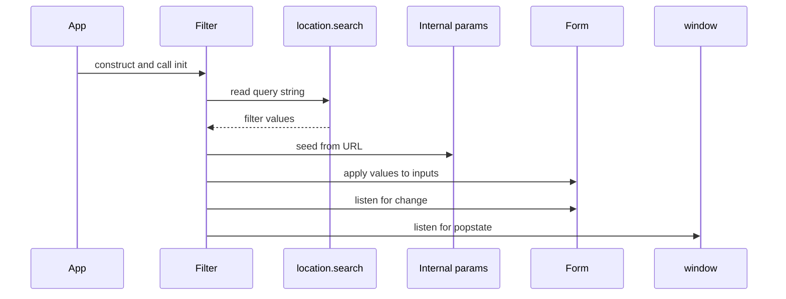
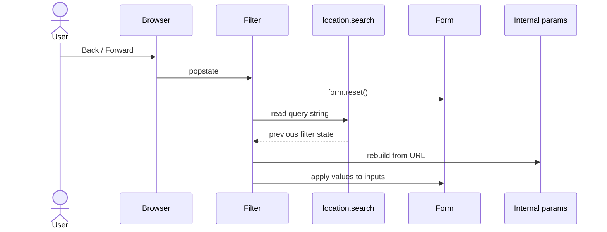

# Architecture

The library is reactive at three discrete moments. Outside those, it does nothing.

## 1. Page load — `init()`

Hydrate the form from the current URL and start listening for changes.

After `init()` the form visually matches the URL and is wired to `change` and `popstate`.

## 2. User edits the form

Every `change` event updates the **internal** params only. The URL stays untouched until you commit
it explicitly. See [Reset & Apply](/guide/reset-and-apply) for the Apply diagram and code.

The reason for the split: a form with several controls would otherwise produce one history entry per
keystroke. Buffering changes in internal state lets one Apply click become one history entry —
predictable Back / Forward, predictable shareable URLs.

## 3. Back / Forward — `popstate`

The browser fires `popstate` when the user navigates the history stack. The library re-hydrates the
form to match the new URL.

The `form.reset()` call matters: without it, controls that were checked / selected in the _current_
state but absent from the _previous_ state would stay set.

## What runs outside these three moments

Nothing. The library does not poll, does not watch the URL, does not listen for keystrokes other
than the `change` event the browser dispatches on commit. If your app mutates `location.search`
itself (a third-party widget, manual `pushState` from elsewhere), call `filter.updateDom()` after
the mutation to resync the form.
