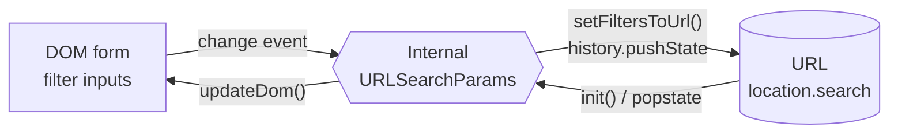

# Introduction

`@kassaila/filter-dom-url` is a tiny browser-only TypeScript library that keeps form filter controls
(`<input>`, `<select>`) in sync with `URLSearchParams` and `window.history`.

## How it stays in sync

Three pieces of state, with `URLSearchParams` in the middle as the single source of in-memory truth.

- **DOM ↔ Params**: every `change` event writes into the internal params; `updateDom()` pushes them
  back into the form.
- **Params → URL**: only `setFiltersToUrl()` and `resetUrl()` mutate the URL (one `pushState` each).
- **URL → Params**: only on `init()` (page load) and `popstate` (Back / Forward).

The point of routing everything through internal params is that you can edit the form many times and
still produce **one** history entry on Apply. See [Architecture](/guide/architecture) for the full
motion picture.

## When you reach for it

It targets a single, common UI pattern: a list/grid page with a form of filters on the side. You
want:

- the URL to be the **source of truth** — share it, refresh it, copy-paste it, and the filtered
  state comes back exactly the same;
- the **back/forward** buttons to step through filter states the user actually went through;
- minimal glue between the form and the URL — no router, no state library, just `<input>` and
  `<select>`.

## What it does

- Reads filter values from `location.search` on `init()` and applies them to the form.
- Listens for `change` on every filter element and tracks the form state in an internal
  `URLSearchParams`.
- On `setFiltersToUrl()`, commits that internal state to the URL via `history.pushState`.
- On `popstate`, resets the form and re-applies the URL filters.

The split between internal state and the actual URL is deliberate — it lets you batch many edits
into a single Apply click, which becomes one history entry. See
[Reset & Apply](/guide/reset-and-apply) for the patterns.

## What it does not do

- It does **not** fetch data. You wire your data-loading layer to the URL however you want
  (`getFilters()` is provided as a convenience).
- It does **not** render anything. You write the HTML form. The library only reads/writes form
  values and URL params.
- It is **not** a router. It only calls `pushState` / listens to `popstate`.
- It is **not** SSR-safe. Instantiate `Filter` on the client only.

## When to reach for it

Use it when your filters are a static set of `<input>` / `<select>` elements and you want the URL to
reflect them with one line of setup. If you need cross-page state, derived state, or async filters,
a state library will fit better.

## Next

- [Getting Started](/guide/getting-started) — install and wire up your first form.
- [Supported Elements](/guide/supported-elements) — the nine recognized control types.
- [URL Serialization](/guide/url-serialization) — the wire format multi-value filters use.
