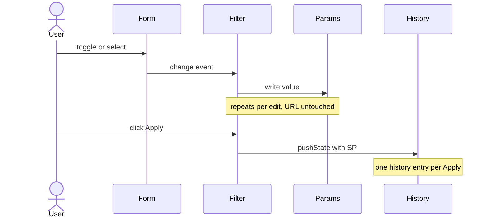

# Reset & Apply

The library keeps two pieces of state separate:

- An **internal `URLSearchParams`** that tracks what the form currently shows. It is updated on
  every `change` event automatically.
- The **actual URL** (`location.search`). It is only written by `setFiltersToUrl()` and
  `resetUrl()`, never by change events.

That split is what lets you batch many field edits into a single history entry. To commit the
internal state to the URL you call `setFiltersToUrl` — typically from an Apply button.



## Apply

```ts
const filter = new Filter({
  formAttr: 'data-filter-form="search"',
  filterAttr: 'data-filter',
});

filter.init();

document.querySelector('[data-filter-apply]')?.addEventListener('click', () => {
  filter.setFiltersToUrl(new URL(window.location.href));
});
```

`setFiltersToUrl` performs a single `history.pushState` from the current form state, so only one
history entry is created no matter how many fields the user changed.

## Reset

A native `<button type="reset">` inside the form clears the inputs. Pair it with `filter.resetUrl()`
to clear the URL params at the same time:

```ts
document.querySelector('[data-filter-reset]')?.addEventListener('click', () => {
  filter.resetUrl();
});
```

Or call both explicitly if you don't have a native reset button:

```ts
filter.resetDom();
filter.resetUrl();
```

## Auto-apply on every change

If you want the URL to update on every change instead of only on Apply, listen for `change` yourself
and call `setFiltersToUrl`:

```ts
$form.addEventListener('change', () => {
  filter.setFiltersToUrl(new URL(window.location.href));
});
```

Each change becomes its own history entry. Sensible for small forms; bad for forms with many fields
where each keystroke or scrub would create a useless entry.

## Helper methods

| Method         | Effect                                                                                       |
| -------------- | -------------------------------------------------------------------------------------------- |
| `resetDom()`   | `form.reset()` — clears the inputs but leaves the URL alone                                  |
| `resetUrl()`   | Removes every known filter param from the URL via `pushState`                                |
| `updateDom()`  | Re-reads the URL and pushes it into the form (use after URL writes from outside the library) |
| `getFilters()` | Returns the parsed `{ [type]: string[] }` snapshot of the internal state                     |
| `destroy()`    | Removes all `change` and `popstate` listeners added by `init()` — call on component teardown |

## Combining with data fetching

The library does not fetch data. Wire your loader to `popstate` plus your own commit point (Apply
click, or every change if you went auto-apply), and call it with `filter.getFilters()`:

```ts
const load = () => fetchResults(filter.getFilters());

window.addEventListener('popstate', load);
document.querySelector('[data-filter-apply]')!.addEventListener('click', load);

load();
```
