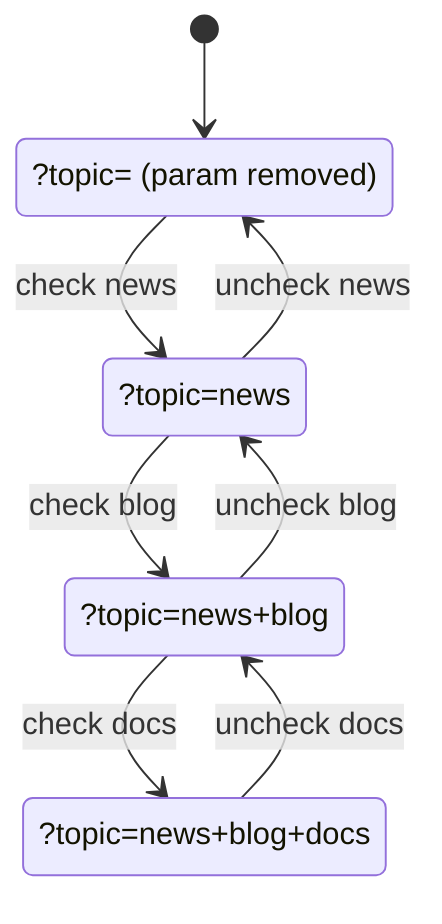

# URL Serialization

The URL is the source of truth. This page documents the wire format.

## Single-value filters

`select-single`, `radio`, `color`, `range`, `date`, `month`, `week`, `time` all use one URL param
per filter, with the literal control value:

```
?sort=popular&size=m&from=2026-01-01
```

Setting an empty value removes the param.

## Multi-value filters: space-joined

`checkbox` and `select-multiple` are serialized as a **single param** whose value is a
**space-joined string** of selected option values. They are **not** repeated keys.

```
?topic=news+blog&tags=tag-a+tag-c
```

(`+` is just URL-encoded space — `?topic=news%20blog` is the same payload.)

::: tip Wire contract

The space-joined format is the public wire contract for multi-value filters. If you parse the URL
yourself, split on space — not on `,` or repeated keys.

:::

### Toggle transitions

How three checkboxes (`news`, `blog`, `docs`) collapse into a single `topic` param:



When the last value is removed, the param itself is **deleted** from the URL — there is no `?topic=`
sitting empty. The same applies to `select-multiple`: deselecting all options removes the param
entirely rather than writing an empty string.

Checking a value that is already present in the URL param is a no-op — the library deduplicates
before writing, so a value never appears twice in the space-joined string.

## `getFilters()` shape

`filter.getFilters()` parses the current URL into a normalized object:

```ts
{
  topic: ['news', 'blog'],
  tags: ['tag-a', 'tag-c'],
  sort: ['popular'],
}
```

Single-value filters still come back as a one-item array.

## History integration

- `setFiltersToUrl(newUrl)` calls `window.history.pushState(null, '', updatableUrl)` with the
  internal `URLSearchParams`. This is what creates a new history entry — typically wired to an Apply
  button.
- `resetUrl()` is a one-shot pushState that clears every known filter param.
- A `popstate` listener (added in `init()`) reacts to **Back / Forward** by calling `form.reset()`
  and re-applying the URL filters to the DOM.

Each Apply click is one history entry. Shareable URLs and predictable Back/Forward behavior fall out
of that for free.

## Why space-joined and not repeated keys?

Two practical reasons:

- **Shorter URLs.** `?topic=news+blog+docs` is shorter than `?topic=news&topic=blog&topic=docs`.
- **Stable param order.** Repeated keys interleave with other params; a single param keeps each
  filter in one slot.

The trade-off: option values must not contain a literal space. If your options can contain spaces,
slugify them before binding to `value=""`.
